# Brain Tumor Segmentation with U-Net

This project implements a U-Net architecture for segmenting brain tumors from MRI images. It is designed to be scalable and supports Distributed Data Parallel (DDP) training on multiple GPUs (e.g., A100s).

## Model Architecture

The model follows the standard U-Net "U" shape, consisting of a contracting path (encoder) and an expansive path (decoder).

### Mermaid Diagram

```mermaid
graph LR
    subgraph Encoder [Contracting Path]
        Input(Input Image) --> Inc["DoubleConv <br/> (In -> Base)"]
        Inc --> |Skip Connection 1| Down1["Down Sample <br/> (Base -> 2*Base)"]
        Down1 --> |Skip Connection 2| Down2["Down Sample <br/> (2*Base -> 4*Base)"]
        Down2 --> |Skip Connection 3| Down3["Down Sample <br/> (4*Base -> 8*Base)"]
        Down3 --> |Skip Connection 4| Down4["Down Sample <br/> (8*Base -> 16*Base)"]
    end

    subgraph Decoder [Expansive Path]
        Down4 --> Up1["Up Sample <br/> (16*Base -> 8*Base)"]
        Up1 --> |Concat Skip 4| ConvUp1[DoubleConv]
        
        ConvUp1 --> Up2["Up Sample <br/> (8*Base -> 4*Base)"]
        Up2 --> |Concat Skip 3| ConvUp2[DoubleConv]
        
        ConvUp2 --> Up3["Up Sample <br/> (4*Base -> 2*Base)"]
        Up3 --> |Concat Skip 2| ConvUp3[DoubleConv]
        
        ConvUp3 --> Up4["Up Sample <br/> (2*Base -> Base)"]
        Up4 --> |Concat Skip 1| ConvUp4[DoubleConv]
    end

    ConvUp4 --> OutC["OutConv <br/> (1x1 Conv)"]
    OutC --> Output(Segmentation Mask)

    %% Skip Connections
    Inc -.-> Up4
    Down1 -.-> Up3
    Down2 -.-> Up2
    Down3 -.-> Up1

    style Input fill:#f9f,stroke:#333,stroke-width:2px
    style Output fill:#f9f,stroke:#333,stroke-width:2px
```

## Component Details

### 1. Contracting Path (Encoder)
- Captures context and extracts features.
- Consists of repeated applications of **DoubleConv** (two 3x3 convolutions, each followed by BatchNorm and ReLU) and **Max Pooling** (2x2) for downsampling.
- At each step, the number of channels doubles.

### 2. Expansive Path (Decoder)
- Enables precise localization.
- Consists of **UpSampling** (or Transpose Convolution) followed by a concatenation with the corresponding feature map from the contracting path (Skip Connection).
- Followed by **DoubleConv** to refine the features.
- At each step, the number of channels is halved.

### 3. Skip Connections
- Connect the encoder layers to the corresponding decoder layers.
- Allow the network to retain high-resolution spatial information lost during pooling, which is crucial for accurate segmentation boundaries.

### 4. Scalability
- The model is initialized with a `base_channels` parameter (default: 64, scaled to 128 in this project).
- All layer widths scale relative to this base, allowing easy adaptation to larger hardware (like A100s).

